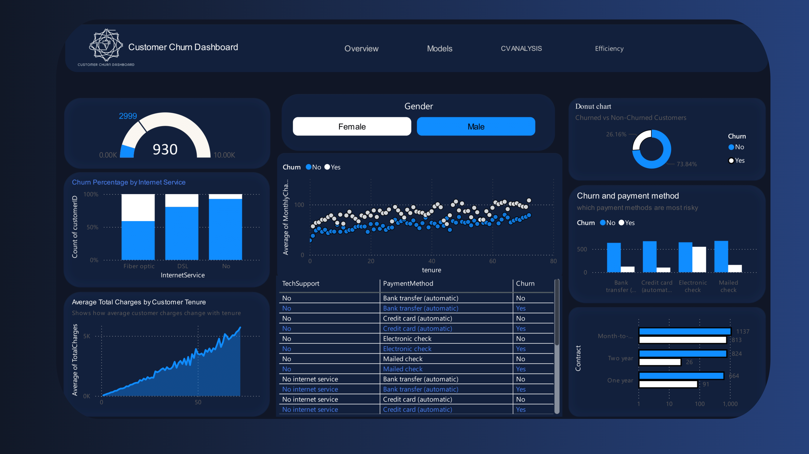

# Customer Churn Prediction with Power BI

This project implements a machine learning pipeline for customer churn prediction and visualizes the results using Power BI dashboards. The goal is to evaluate multiple models and present their performance in a clear business intelligence format

## Overview

- 16 machine learning models trained and evaluated
- Python-based machine learning pipeline
- Power BI dashboards for model comparison and analysis

## Machine Learning Pipeline

The pipeline is implemented in Python and includes:

- Data preprocessing and feature engineering
- Label encoding and feature scaling
- Handling class imbalance
- Cross-validation with multiple fold configurations
- Model training and evaluation
- Export of results as CSV files for Power BI

### Models Used

- Logistic Regression
- Decision Tree
- Random Forest
- Extra Trees
- Gradient Boosting
- AdaBoost
- XGBoost
- LightGBM
- Support Vector Machine
- K-Nearest Neighbors
- Naive Bayes
- Linear Discriminant Analysis
- Quadratic Discriminant Analysis
- Multi-Layer Perceptron

## Evaluation Metrics

- Accuracy
- Precision
- Recall
- F1 Score
- ROC-AUC
- Confusion Matrix
- Training Time

### Best Model

- Extra Trees Classifier
- F1 Score: 0.8562
- ROC-AUC: 0.9349

## Power BI Dashboards

The Power BI report includes four dashboards:

1. Dataset Overview  
   - Customer distribution  
   - Churn rate  
   - Feature summaries  

2. Model Performance  
   - Comparison of F1, AUC, precision, and recall  
   - Best and worst model identification  

3. Cross-Validation Analysis  
   - Performance across different fold configurations  
   - Model stability analysis  

4. Training Efficiency and Error Analysis  
   - F1 score versus training time  
   - Confusion matrix and error breakdown  

## Data Model

- Star schema design
- Optimized table relationships
- Single-direction filtering
- DAX measures for analysis

## Technology Stack

- Python (pandas, scikit-learn, XGBoost, LightGBM)
- Power BI Desktop
- DAX
- Power Query

